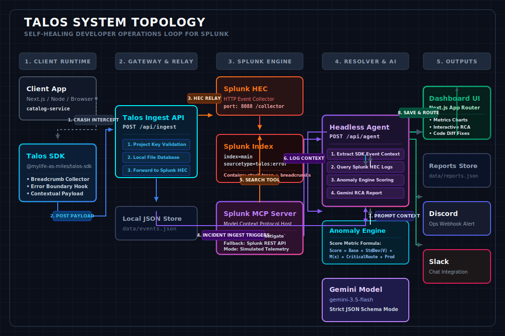

# Talos 🤖

[](https://opensource.org/licenses/MIT)
[](https://github.com/mylife-as-miles/Talos/pulls)
[](https://www.typescriptlang.org/)
[](https://nextjs.org/)

Talos is an advanced, **self-healing AI developer operations (DevOps) and site reliability engineering (SRE) system** integrated with **Splunk**. 

By closing the loop between runtime crash captures, telemetry ingestion, and agentic root-cause analysis (RCA), Talos transforms Splunk from a passive search utility into an active, autonomous partner for resolution. When an application crashes, Talos captures the context via its SDK, sends it to Splunk, uses an AI agent via the **Model Context Protocol (MCP)** to search and correlate logs, runs statistical anomaly analysis, and pushes fix-ready code diffs to developer dashboards and team communication channels (Slack/Discord).

---

## 📐 Architecture Topology

Talos is designed around a strict decoupling of telemetry collection, data warehousing, agentic investigation, and interactive reporting.

<p align="center">
  
</p>

### The 4-Step Self-Healing Loop

1. **Capture & Intercept**: The `@mylife-as-miles/talos-sdk` catches unhandled exceptions, records user interactions (breadcrumbs), and packages them into a structured JSON payload.
2. **Ingest & Forward**: The browser-safe Ingest API Gateway validates the project payload and securely forwards events to the **Splunk HTTP Event Collector (HEC)** while caching a local copy for resilience.
3. **Agentic Investigation**: When an incident is registered, the Headless AI Resolver triggers. It accesses Splunk via the **Splunk MCP Server** to run context-gathering search queries. If Splunk MCP is offline, it falls back to the Splunk REST search API, or simulated telemetry during offline demos.
4. **Cognitive Analysis & Alerting**: The resolver calculates statistical anomaly scores, feeds the full context to a Gemini model, generates a structured triage report with code-level proposed fixes, updates the Talos dashboard, and sends chat alerts.

---

## 🚀 Key Features

* **📦 `@mylife-as-miles/talos-sdk`**: A multi-environment (Browser & Node.js) TypeScript SDK for capturing unhandled runtime exceptions and tracking event breadcrumbs.
* **🛡️ Browser-Safe Ingest Gateway**: Next.js App Router endpoints that act as secure relays, protecting Splunk HEC auth tokens and secrets from being exposed on the client side.
* **🔌 Splunk MCP Server Integration**: An integration layer supporting the Model Context Protocol (MCP) to let AI agents run search queries, check index metadata, and inspect logs natively.
* **🧠 Cognitive RCA Engine**: Integrates with Gemini models (e.g., `gemini-3.5-flash`) via structured JSON schema mode to synthesize root-cause assessments and code-level proposed fixes.
* **📈 Statistical Anomaly Engine**: Performs standard-deviation calculations over baseline error rates, event frequency, and route criticality weights to classify blast radius.
* **💬 Webhook Dispatchers**: Formats and delivers incident reports to Slack and Discord channels with Markdown code-diff attachments.
* **💻 Brutalist Neubrutalism Dashboard**: A high-impact Next.js dashboard built using neubrutalist UI design specs (loud borders, sparklines, interactive telemetry inspect tables, and inline AI diff comparisons).
* **🔌 Simulation Sandbox**: First-class simulated telemetry mode which exercises the entire pipeline without requiring a live Splunk instance or active LLM API keys.

---

## 📂 Repository Workspace Structure

Talos is managed as a monorepo utilizing **pnpm workspaces**:

```text
Talos/
├── apps/
│   └── web/                   # Next.js App Router dashboard UI and Ingest/Agent APIs
│       ├── app/               # Routes, shell views, and API controllers
│       ├── components/        # Neubrutalist React components
│       ├── data/              # Local file-backed database storage (events.json / reports.json)
│       └── lib/               # Core business logic (AI, Splunk clients, Anomaly scorer)
├── packages/
│   └── sdk/                   # TypeScript SDK source package
│       ├── src/               # Breadcrumb logging, stacktrace parsers, and transport layers
│       └── dist/              # Compiled ESM/CJS exports for distribution
├── infra/
│   └── splunk-mcp-server/     # Git submodule of upstream Splunk MCP server integration
├── docs/                      # Supplemental setup and scripting documentation
├── architecture.svg           # Scalable vector graphics system topology diagram
├── package.json               # Root monorepo configuration
├── pnpm-workspace.yaml        # PNPM workspace definition
└── pnpm-lock.yaml             # Lockfile for reproducible builds
```

---

## 🛠️ Quickstart Installation

Ensure you have [Node.js v18+](https://nodejs.org/) installed on your machine.

### 1. Enable Corepack & Install Dependencies
Talos uses `pnpm` for monorepo dependency resolution. Enable corepack to guarantee the correct package manager version:

```bash
corepack enable
corepack pnpm install
```

### 2. Configure Environment Variables
Copy the template configuration file to your web app's local environment:

```bash
cp .env.example apps/web/.env.local
```

> [!NOTE]
> By default, `TALOS_SIMULATION_MODE=true` is enabled in `.env.example`. This allows you to explore the dashboard and run simulation scenarios without configuring credentials for Splunk or Gemini.

### 3. Build SDK and Run Development Servers
Build the SDK package and launch the Next.js development server:

```bash
# Build the local SDK workspace package
corepack pnpm --filter @mylife-as-miles/talos-sdk build

# Start the dev servers
corepack pnpm dev
```

Open [http://localhost:3000/dashboard](http://localhost:3000/dashboard) to explore the neubrutalist Talos Dashboard.

---

## 🔌 Splunk Integration Setup

To shift from the offline sandbox into production-grade live telemetry, follow these configuration setups:

### 1. HTTP Event Collector (HEC) Setup
The SDK forwards events via the Ingest Gateway into the Splunk HTTP Event Collector.
1. In your Splunk Enterprise or Cloud instance, navigate to **Settings** > **Data Inputs** > **HTTP Event Collector**.
2. Click **New Token** and name it `talos-sdk`.
3. Select your destination index (typically `main`).
4. Enable the token, copy the secret value, and update `apps/web/.env.local`:
   ```env
   TALOS_SIMULATION_MODE=false
   SPLUNK_HEC_URL=http://your-splunk-host:8088
   SPLUNK_HEC_TOKEN=your-hec-token-uuid
   SPLUNK_INDEX=main
   SPLUNK_SOURCE=talos-sdk
   SPLUNK_SOURCETYPE=talos:error
   ```

### 2. Splunk Model Context Protocol (MCP) Server Setup
Talos uses the MCP protocol as its primary SRE investigation mechanism, giving the AI agent natural search capabilities over logs.
1. The server code is located under `infra/splunk-mcp-server`.
2. Follow its upstream instructions to install python dependencies and configure connection tokens.
3. Start the MCP server locally (typically binds to port `8000`).
4. Update `apps/web/.env.local` to enable MCP-first resolving:
   ```env
   SPLUNK_MCP_MODE=enabled
   SPLUNK_MCP_SERVER_URL=http://localhost:8000
   ```

### 3. Splunk REST Fallback API
If the Splunk MCP server is unreachable, Talos automatically routes search queries through the default Splunk REST API:
```env
SPLUNK_BASE_URL=https://your-splunk-host:8089
SPLUNK_USERNAME=admin
SPLUNK_PASSWORD=your-admin-password
SPLUNK_TOKEN=your-auth-token
```

---

## 🧠 AI Cognitive Engine Configurations

Talos utilizes Google's Gemini models to analyze incident context, formulate hypotheses, and propose code fixes.

Update the following keys in `apps/web/.env.local` to connect your keys:
```env
AI_PROVIDER=gemini
GEMINI_API_KEY=AIzaSy...your-gemini-key
GEMINI_MODEL=gemini-3.5-flash-medium
```

> [!TIP]
> **BYOK (Bring Your Own Key)** is supported directly in the Talos UI! You can paste your Gemini API Key directly in the dashboard settings panel. This key is saved in browser local storage and transmitted safely via request headers, bypassing server-side configurations.

---

## 📦 Talos SDK Integration Guide

Integrating the SDK into your own TypeScript application requires just a few lines of code.

### Installation
Reference the local package in your project's `package.json` dependencies:
```json
"dependencies": {
  "@mylife-as-miles/talos-sdk": "workspace:*"
}
```

### Initialization
Initialize the SDK at your application's entrypoint:
```typescript
import { Talos } from "@mylife-as-miles/talos-sdk";

Talos.init({
  projectKey: "backstage-prod-009",
  environment: "production",
  release: "v1.4.2",
  service: "catalog-service",
  ingestUrl: "http://localhost:3000/api/ingest" // Points to your Talos gateway
});
```

### Capturing Errors & Context
Capture exceptions dynamically within try-catch blocks and associate user tags or metadata:
```typescript
// Add breadcrumbs for trace correlation
Talos.addBreadcrumb({
  category: "ui",
  message: "Catalog provider refresh started",
  timestamp: new Date().toISOString()
});

try {
  await executePayment(cart);
} catch (error) {
  // Capture the error and provide execution context
  await Talos.captureException(error, {
    route: "/api/catalog/entities",
    userId: "user_99a8b11c",
    tags: {
      gateway: "Stripe",
      currency: "USD"
    }
  });
}
```

---

## 📊 Technical Deep-Dive

### 1. The Anomaly Scoring Formula
Talos calculates an anomaly score \(\text{Score} \in [0, 100]\) for every incident to determine SRE priority. The score combines real-time volume metrics with code criticality markers:

$$\text{Score} = \text{Base} + S_V + S_M + S_C + S_P + S_R$$

Where:
* **Base**: Initial starting constant score of \(20\).
* **Volume Variance ($S_V$)**: Evaluated using standard deviations ($\sigma$) of the error rate over the historical average ($\mu$):
  $$S_V = \begin{cases} 45 & \text{if } V > \mu + 3\sigma \\ 32 & \text{if } V > \mu + 2\sigma \\ 18 & \text{if } V > \mu + \sigma \\ 0 & \text{otherwise} \end{cases}$$
* **Match Repeat Frequency ($S_M$)**: Splunk repeat counts. If matching logs exceed limit:
  $$S_M = \begin{cases} 18 & \text{if } M \ge 5 \\ 0 & \text{otherwise} \end{cases}$$
* **Critical Route ($S_C$)**: Regular expression matching on critical developer portal namespaces (`catalog`, `scaffolder`, `techdocs`, `auth`, `search`):
  $$S_C = \begin{cases} 15 & \text{if path matches} \\ 0 & \text{otherwise} \end{cases}$$
* **Environment ($S_P$)**: Production blast penalty. If environment is `"production"`, $S_P = 10$, else $0$.
* **Release Regression Scope ($S_R$)**: If no release version metadata is specified, debugging difficulty rises. If `release` is missing, $S_R = 5$, else $0$.

The final score is capped: \(\text{Score} = \min(100, \text{Score})\). The severity tier is mapped as follows:
* **Critical**: \(\ge 85\)
* **High**: \(\ge 70\)
* **Warning**: \(\ge 45\)
* **Normal**: \(< 45\)

---

## 📈 Example Telemetry Dataset

Below are raw telemetry payloads illustrating the data structures transmitted throughout the system:

### 1. Ingest Payload (`TalosErrorEvent`)
Sent by the SDK when an exception is caught:

```json
{
  "eventId": "e4b2d13a-7f2c-4903-a178-59a6c9d74f32",
  "projectKey": "demo_project_key",
  "environment": "production",
  "release": "v1.0.0",
  "service": "catalog-service",
  "route": "/api/catalog/entities",
  "timestamp": "2026-06-15T11:45:00.000Z",
  "error": {
    "name": "TypeError",
    "message": "Cannot read properties of undefined (reading 'metadata')",
    "stack": "TypeError: Cannot read properties of undefined (reading 'metadata')\n    at processCatalogEntity (packages/backend/src/plugins/catalog.ts:87:22)\n    at CatalogBuilder.build (packages/backend/src/catalog/CatalogBuilder.ts:142:9)"
  },
  "breadcrumbs": [
    { "category": "ui", "message": "User clicked submit payment", "timestamp": "2026-06-15T11:44:50.000Z" },
    { "category": "network", "message": "POST /api/cart/validate - 200 OK", "timestamp": "2026-06-15T11:44:52.000Z" }
  ],
  "context": {
    "userId": "demo-user-123",
    "tags": {
      "feature": "entity-processing",
      "region": "us-east"
    }
  }
}
```

### 2. Output AI Triage Report (`TalosTriageReport`)
Generated by the AI resolver after Splunk investigation and anomaly scoring:

```json
{
  "incidentId": "INC-E4B2D13A",
  "eventId": "e4b2d13a-7f2c-4903-a178-59a6c9d74f32",
  "priority": "critical",
  "status": "triaged",
  "trigger": "TypeError: Cannot read properties of undefined (reading 'metadata')",
  "summary": "catalog-service crashed on /api/catalog/entities after the SDK captured TypeError. Splunk context shows 12 matching errors.",
  "rootCause": "The catalog processor received an entity without a complete metadata block during provider refresh.",
  "timeSinceEvent": "just now",
  "affectedService": "catalog-service",
  "affectedRoute": "/api/catalog/entities",
  "anomaly": {
    "score": 98,
    "level": "critical",
    "reasons": [
      "Current error volume is more than three standard deviations above baseline.",
      "Splunk found repeated matching errors.",
      "Failure affects a critical developer portal workflow.",
      "Event occurred in production."
    ]
  },
  "evidence": [
    { "message": "SDK captured TypeError: Cannot read properties of undefined (reading 'email')", "source": "sdk", "timestamp": "2026-06-15T11:45:00.000Z" }
  ],
  "proposedFix": {
    "explanation": "Guard the authenticated user before payment execution and return a typed 401 response when user context is absent.",
    "code": "if (!user?.email) {\n  return NextResponse.json({ error: \"Unauthorized\" }, { status: 401 });\n}\n\nawait processPayment({ userEmail: user.email, cart });",
    "steps": [
      "Guard catalog entity metadata before processor access.",
      "Add a regression test for malformed provider entities.",
      "Deploy with release metadata so Talos can correlate future regressions."
    ]
  },
  "splunk": {
    "mode": "mcp",
    "queryUsed": "search index=main service=catalog-service route=/api/catalog/entities \"Cannot read properties of undefined (reading 'metadata')\" earliest=-15m",
    "eventCount": 12
  },
  "confidence": 95,
  "createdAt": "2026-06-15T11:45:10.000Z"
}
```

---

## 🛠️ Development & QA Workflows

Ensure your code changes comply with the repository formatting and styling standards:

### Run Code Linter
Analyze source files for syntax and stylistic inconsistencies:
```bash
corepack pnpm --filter @talos/web lint
```

### Run Type Checking
Verify TypeScript compiler options and type assertions:
```bash
corepack pnpm --filter @talos/web typecheck
```

---

## 🔮 Production Roadmap

* [ ] **Permanent Storage Layer**: Migrate from local file-backed JSON stores (`/data/*.json`) to a secure Supabase/PostgreSQL schema.
* [ ] **Auto-Remediation PR Generator**: Automate the creation of GitHub Pull Requests containing the AI resolver's code-level fixes.
* [ ] **MCP Tooling Enhancements**: Equip the Splunk MCP server with interactive remediation actions (e.g. service restarts, rollback deployments).
* [ ] **SAML/OIDC Auth**: Configure SSO credentials to limit dashboard read access to certified DevOps engineers.

---

## 📄 License

Distributed under the MIT License. See [LICENSE](file:///c:/Users/MILES/Documents/Talos/LICENSE) for more information.
